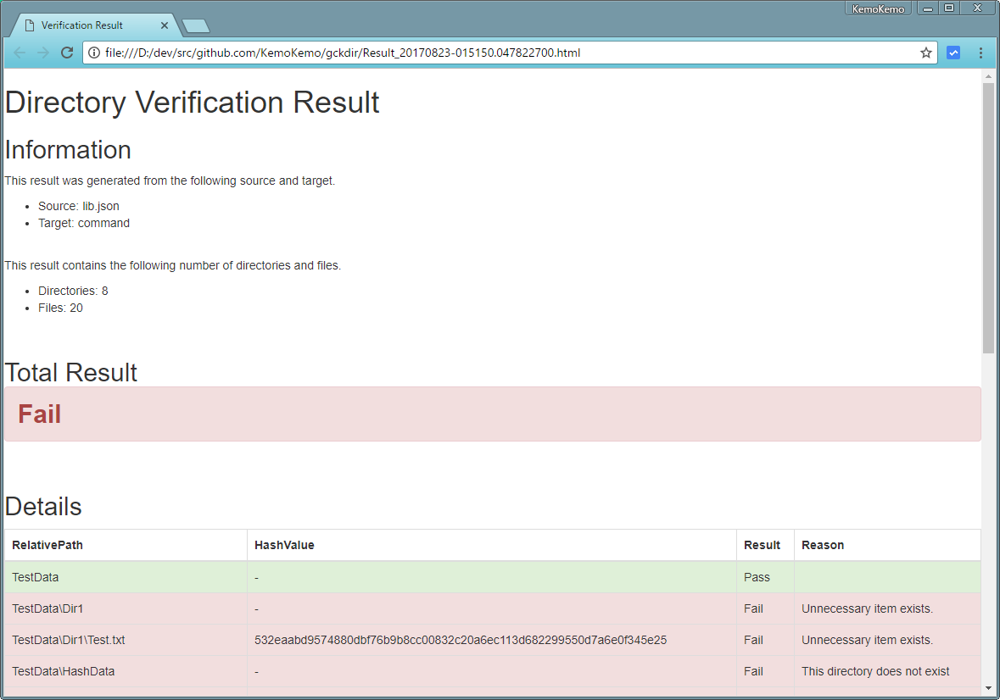
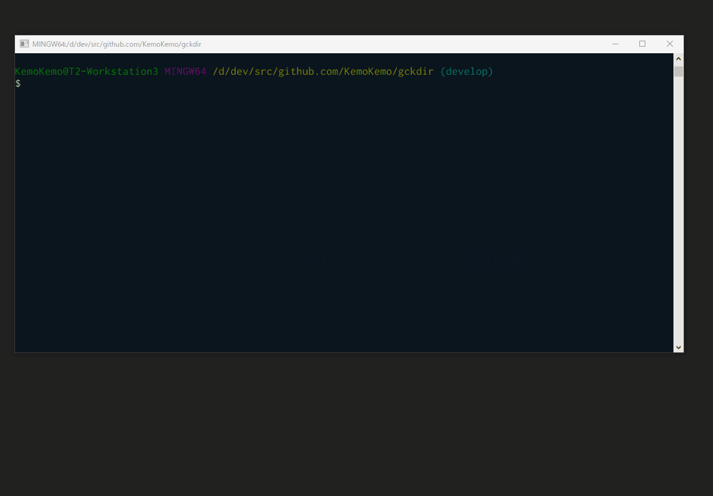

[](https://travis-ci.org/kemokemo/gckdir) [](https://coveralls.io/github/kemokemo/gckdir?branch=master) [](https://goreportcard.com/report/github.com/kemokemo/gckdir) [](https://github.com/goreleaser)

# gckdir

This is go-check-directory tool.

## Description

This tool can generate a hash list of specified directory in the json format.  
With the hash list, you can verify the target directory's structure and each hash value
of files.

## Usage

### Generate

```bash
$ gckdir generate path/to/source_directory hash_name.json
```

For more details, please see `gckdir generate --help`.

### Verify

```bash
$ gckdir verify hash_name.json path/to/target_directory
```
or
```bash
$ gckdir verify path/to/source_directory path/to/target_directory
```

For more details, please see `gckdir verify --help`.

#### Create a result report

```bash
$ gckdir verify --report hash_name.json path/to/target_directory
```

You can create a verification result report with `--report` or `-r` option.



#### Create a report file with the name specified

```bash
$ gckdir verify --report --output output_name.html hash_name.json path/to/target_directory
```

You can specify the file name of the report file to be generated by this `--output` or
`-o` option. Use with the `--report` and` --open` options.

If you do not specify a report file name with this option, it is automatically named in the format of `Result_{YYYYMMDD}-{hhmmss}.{nanosecond}.html`.

#### Create and open immediately a result report

```bash
$ gckdir verify --open hash_name.json path/to/target_directory
```

If you want to check the result immediately on the browser, please use the `--open` or `-p` option. This option includes the `--report` option.



#### Verify only the structure of files and directories

```bash
$ gckdir verify --no-hv hash_name.json path/to/target_directory
```

Please use `--no-hv` or `-nh` option if you only want to check if files and directories are arranged with the intended structure and ignore the difference in hash value. This option can be used with `--open` or `--report`.

#### Ignore files of other software

```bash
$ gckdir verify --no-uv hash_name.json path/to/target_directory
```

Please use `--no-uv` or `-nu` option if you want to ignore files of other software in the target directory. This option can be used with `--open` or `--report`.

## ExitCode

ExitCode returns with 0 if all processing is successful.  
When a problem occurs, an integer of 1 or more is returned as ExitCode.  
Even when the comparison result is Fail, an integer of 1 or more is returned as ExitCode.

## Install

Please download the one suitable for your platform from [the latest release page](https://github.com/kemokemo/gckdir/releases/latest).  
To get the latest source code, use `go get`:

```bash
$ go get -d github.com/kemokemo/gckdir
```

## Contribution

Please feel free to send me a pull request. :smile:

1. Fork ([https://github.com/kemokemo/gckdir/fork](https://github.com/kemokemo/gckdir/fork))
1. Create a feature branch
1. Commit your changes
1. Rebase your local changes against the master branch
1. Run test suite with the `go test ./...` command and confirm that it passes
1. Run `gofmt -s`
1. Create a new Pull Request

## Author

[kemokemo](https://github.com/kemokemo)

## License

MIT

## Special Thanks

This application uses the following excellent projects.

* [github.com/tcnksm/gcli](https://github.com/tcnksm/gcli) - [MIT](https://github.com/tcnksm/gcli/blob/master/LICENSE)
* [github.com/urfave/cli](https://github.com/urfave/cli) - [MIT](https://github.com/urfave/cli/blob/master/LICENSE)
* [github.com/ahmetb/go-linq](https://github.com/ahmetb/go-linq) - [Apache License 2.0](https://github.com/ahmetb/go-linq/blob/master/LICENSE)
* [github.com/skratchdot/open-golang](https://github.com/skratchdot/open-golang) - [MIT](https://github.com/skratchdot/open-golang/blob/master/LICENSE-MIT)
